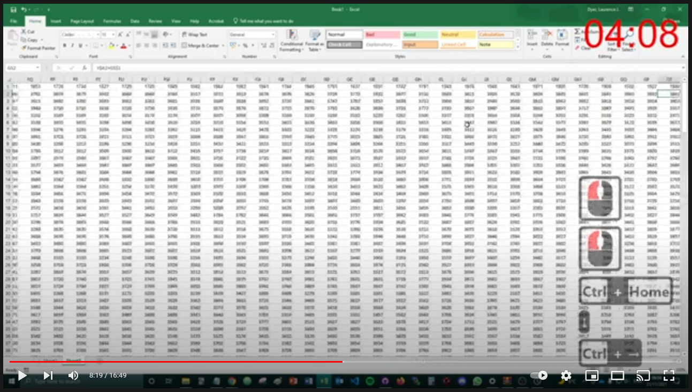

# --- Day 1: Report Repair ---

https://adventofcode.com/2020/day/1

## How I solved it

I decided to solve the problem using Microsoft Excel and set myself a time limit of 10 minutes, which I overran by a couple of minutes.

1. Created a matrix with the list of values along the left side and top, and populated cells with sums.
2. Used **MATCH** formula to get index of number 2020 in each row if it appears.
3. Used **INDIRECT** and **ADDRESS** formulae to get the numbers that were summed to give 2020.
4. Used **AGGREGATE** formula (ignoring cells with errors) to get the product of those two numbers.

Check out the YouTube video to watch me solve the problem:

## Reflections and learning outcomes

Entered an incorrect answer and went over the time limit because I failed to sanity check the output of my formulae. Slow down and relax next time.