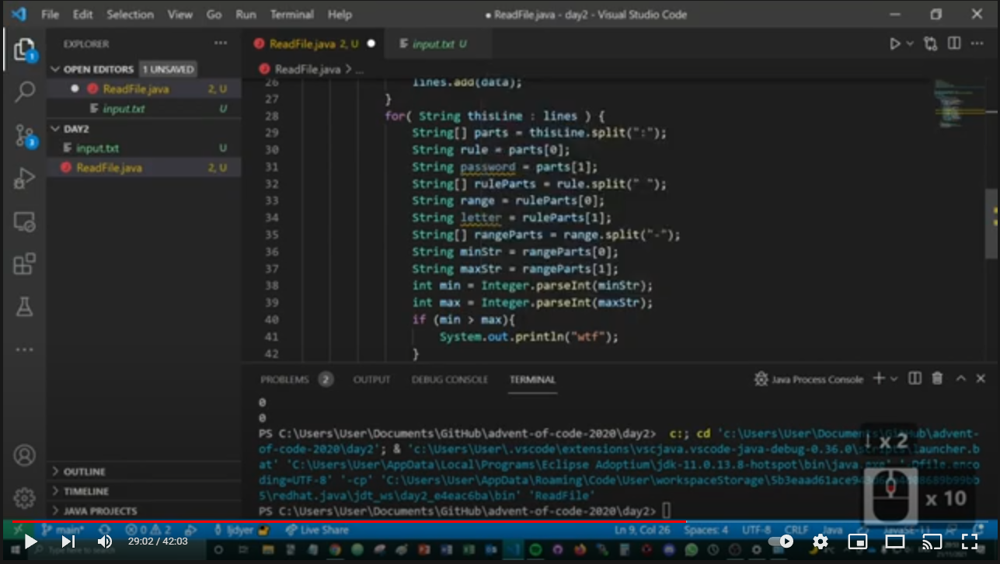

# --- Day 2: Password Philosophy ---

https://adventofcode.com/2020/day/2

## How I solved it

I decided to solve this problem using a completely new programming language - Java. This was the first Java program I had ever written so I was teaching myself as I went. I expected it to take me around one hour but I was able to get the correct solution in around 40 minutes.

1. Read input file and created an 'array list' of line using **Scanner**.
2. For each line:
a) Split each line by ":" character to get rule and password.
b) Split rule part by " " character to get range and letter.
c) Split range part by "-" character to get min and max.
d) Counted number instances of letter in password and added one to counter variable if within permitted range.
3. Printed value of counter variable to get answer.

Check out the YouTube video to watch me solve the problem:

(coming soon)
<!--  -->

## Reflections and learning outcomes

Java is not that scary! Lots of patterns familiar from JavaScript.

Stuff to look into:
- Installing dependencies
- Defining functions (passing arguments, returning values, etc.)