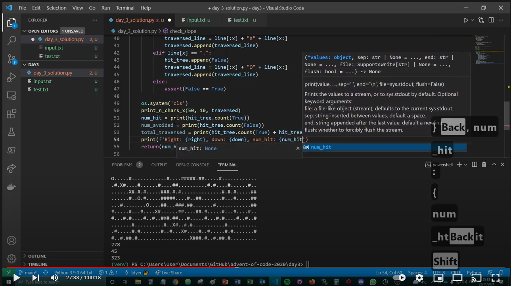

# --- Day 3: Toboggan Trajectory ---

https://adventofcode.com/2020/day/3

## How I solved it

Solved using Python.

Check out the YouTube video to watch me solve the problem (no audio this time):

(coming soon)
<!--  -->

## Reflections and learning outcomes

Careful when using numpy **prod** with large numbers!!!

